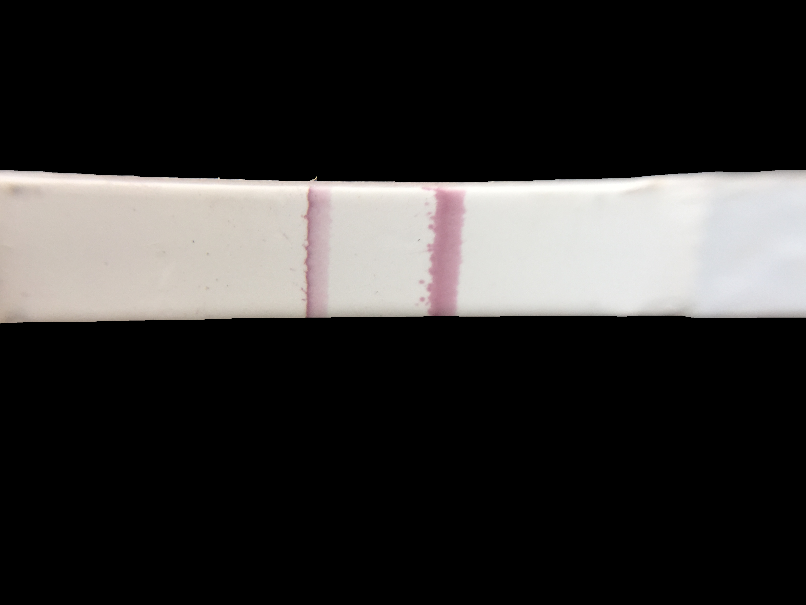

# bstripSegm
Bacterial Strip Segmentation using OpenCV.

- [Project description](#proj-desc)
- [Sample Results](#sample-results)
- [Tutorial](#tutorial)
- [License](#license)

<a name="proj-desc"></a>
## 1. Project description

The Task here is to crop bacterial strip from the test images using traditional image processing techniques.

The solution is provided as an API call in `main.py`

To run solution on a directory of images call:

```
python main.py --input_dir data_input
```
To run solution on a single image call:

```
python main.py --filename data_input/IMG_3112.JPG
```

<a name="sample-results"></a>
## 2. Sample Results

Some sample results can be seen below:

Original Image:


Segmented Strip:



Segmented and Cropped Strip:


Segmented Bacterial Stain:


<a name="tutorial"></a>
## 3. Tutorial
Jupyter-notebook [LINK](./notebook/bacterial_strip_segmentation.ipynb)
